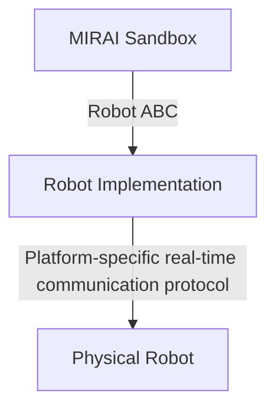
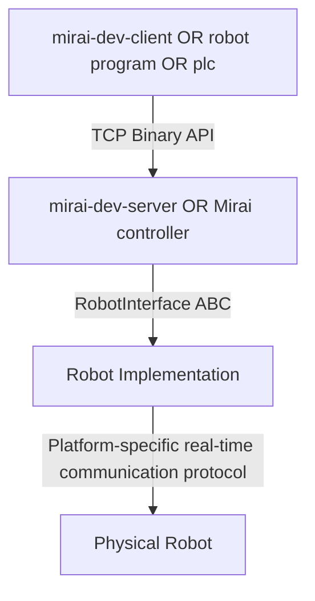

# The Micropsi Integration SDK

## Introduction

The Micropsi Integration SDK enables the development of interfaces between Micropsi Industries’
AI-driven robot control product MIRAI and robot platforms, with the goal of bringing MIRAI’s on-site
trainable "hand-eye coordination" to new robots.

This is done by implementing a Python 3.10 class inheriting an interface defined in any of the 
abstract base classes provided in the `robot_sdk`. This implementation, the “Robot Implementation”,
typically provides the means of communication with the robot (usually a protocol over TCP or UDP)
and the forward (and sometimes inverse) kinematics of the robot, plus safety checks.

Tools are provided for testing the implementation of the chosen abstract base class during
development. After the implementation class works well with these development tools, it can be
integrated into the released MIRAI product in a joint effort together with Micropsi Industries
engineers.

## Preconditions

### Robot Platform Requirements
For a successful implementation, the robot platform to be supported should...
* be an articulated robot, i.e. a kinematic chain with a fixed base on one end and a movable tool 
on the other end
* be able to execute cartesian displacements and rotations provided by MIRAI in the robot flange
frame
* be able to receive a continuous stream of movement commands at or above 20Hz, and smoothly 
execute these movement commands

No assumption needs to be made about where kinematic calculations, path planning, or any form of
smoothing will be implemented. Lightweight scenarios in which the Robot Implementation essentially
just implements the communication protocol with the robot, forwards MIRAI displacement commands and
reports positions, are possible and preferred, but heavier implementations in which kinematic
calculations and even path planning are performed as part of the Robot Implementation are also
common. It’s important to remember however that most code in a Robot Implementation will be called
as part of a high-frequency control loop and needs to execute fast.

### Software Development Requirements

The software environment needed to develop a Robot Implementation consists of:
* Physical access to the robot to be supported, in a safe experimental setup
* (recommended) a faithful software simulation of the robot for first steps
* A development PC. The Integration SDK is cross-platform, however the Mirai production system is
Linux-based. A Linux or MacOS development environment is therefore recommended, to reduce the
potential for unwelcome surprises.
* Python 3.10
* Pip

## Implementation Process

A Platform SDK-based development of a Robot Implementation follows a 4-phase implementation process:

1. **Development Setup**<br>
Set up a Python 3.10 environment with all dependencies provided by the MIRAI Sandbox. Should
additional libraries be required, they can be added to the virtualenv. They should be version-pinned
and ideally discussed with Micropsi Industries to make sure a successful step 4 (MIRAI product
integration) is possible. Additional operating-system level dependencies should be avoided,
but can of course always be discussed.
2. **Implementation**<br>
Choose a base class from those provided in the `robot_sdk`, and implement all the methods it
declares.
3. **Sandbox validation**<br>
Exercise the implementation with the `mirai-sandbox` and observe the physical robot’s behavior.
If the robot does not physically behave as expected, or the `mirai-sandbox` logs errors, go back to
step 2. The `mirai-sandbox` is essentially a lightweight “mock” Mirai controller, emulating a full
Mirai system in its interactions with the Robot Implementation, while also validating and profiling
the Robot Implementation's performance.
4. **MIRAI Integration**<br>
Once a successful validation of the Robot Implementation has been achieved, a full product
integration can be performed. This will be done as a joint effort between Integration SDK users and
Micropsi Industries engineers.

## Architecture Overview and Definitions

The basic structure of a Sandbox development setup is this:


The Robot Implementation essentially functions as glue code between Python method calls made to the
methods defined in the abstract base class and the native real time protocol spoken by the robot.
Depending on the robot platform’s capabilities, some calculations such as inverse kinematics may
need to be performed directly by the Robot Implementation. The MIRAI Sandbox can be transparently
replaced with the actual MIRAI system in a subsequent step.

## Setting up the Environment

1. Install Python 3.10
2. Clone this repository `git clone git@github.com:micropsi-industries/micropsi-integration-sdk.git`
3. Enter the directory you just cloned `cd micropsi-integration-sdk`
4. (recommended) Create and activate a virtual environment `python3 -m venv .venv && source .venv/bin/activate`
5. Install the SDK python package `python3 -m pip install .`
6. Enter the examples directory and investigate the provided examples. Each example extends one of
the available abstract base classes, and demonstrates a unique way that the Mirai system can
communicate motion commands to your implementation. At time of writing, the available examples in
order of preference, are:
   1. `cartesian_velocity_robot` (recommended)
   2. `cartesian_pose_robot`
   3. `joint_position_robot`
   4. `joint_speed_robot`
8. Copy your chosen example file and start modifying it to suit your robot platform.

## Interface Documentation

The abstract base classes for the robot implementations are found in 
`micropsi_integration_sdk/robot_sdk.py`.
See the docstrings for information on the class and the individual methods to be implemented.

## Validating
### Basic communication
Validation (during development and before integration) can be performed with the mirai-sandbox tool.
It is included in the git repo, or can also be installed from pypi via:
```
pip install micropsi-integration-sdk
```

Robot installations can be tested by passing the path to the Python implementation file to the
sandbox, for example, from the directory in which the implementation myrobot.py resides:
```
mirai-sandbox ./examples/cartesian_velocity_robot.py -ip localhost
```

This will launch the sandbox, pass the IP address to the Robot implementation in 
`cartesian_velocity_robot.py`, and exercise the implementation just like a full MIRAI runtime would.
Instead of an AI-driven skill however, a simple 5cm back-and-forth-movement in the x dimension will
be generated for execution on the robot. Once the movement can be perfomed as expected, and the
sandbox does not print any error messages, the implementation can be considered ready for
initial integration with the real Mirai runtime.

The `mirai-sandbox` uses defensive default settings. It is good practise to start with these
settings when working on a physical robot. For platforms that offer a simulator, developing and
validating the implementation against the simulator first is recommended. Once a safe and error-free
execution with the defensive default parameters has been shown, a number of parameters are available
to get more ambitious. These are documented in the [readme](README.md).

### Production loop
The Mirai system exposes a binary API over a TCP socket, which can allow external triggering of
AI-driven robot control. Generally, that external triggering can be performed by an external PLC,
or even by the robot itself, as part of an application-specific production program loop.

For such a use-case, the tools `mirai-dev-server` and `mirai-dev-client` are made available.
These tools are also documented in the [readme](README.md) of this repo, and exploration of the
interfaces is welcomed.
The `mirai-dev-server` tool emulates the behaviour of a full Mirai system within such an 
externally-triggered production loop, similar to the `mirai-sandbox` tool described above.
The `mirai-dev-client` tool emulates the controlling system, and can be used to send commands to a 
listening `mirai-dev-server`, or indeed to a real Mirai controller; however this is not recommended.

The basic structure of a Production loop development setup is this:


